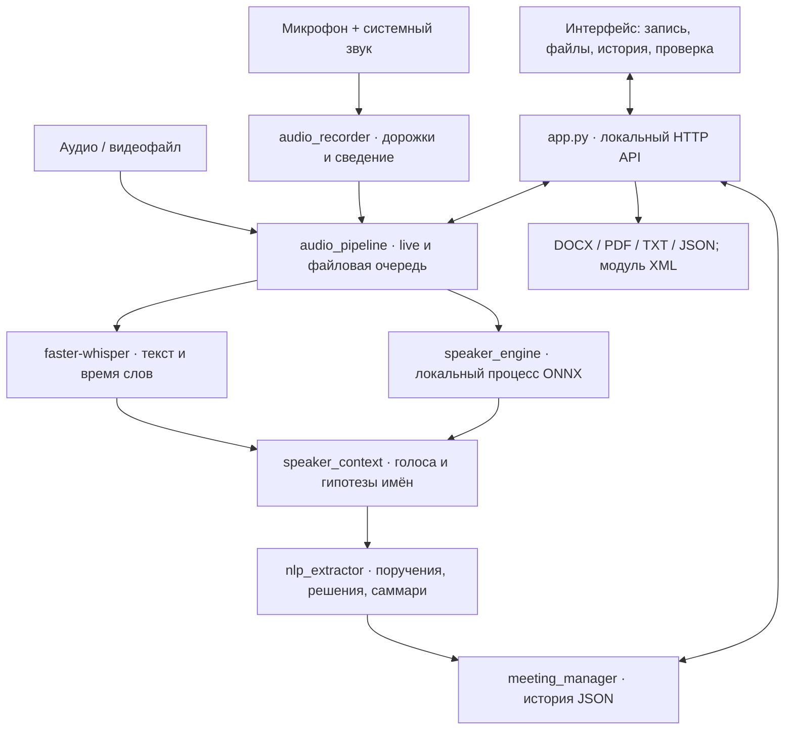

# QazaqProtocol Pro

### Локальный ИИ-ассистент для протоколирования совещаний

**Из аудиозаписи — в стенограмму, поручения и готовый документ. Обработка на компьютере пользователя, без облачных API и ключей.**

QazaqProtocol Pro помогает секретарям, руководителям и кураторам поручений сохранить договорённости совещания: кто говорил, что необходимо сделать и к какому сроку. Приложение распознаёт речь, разделяет голоса, предлагает имена участников по контексту и формирует черновик протокола для проверки и экспорта.

Проект ориентирован на русские, казахские и смешанные совещания. Название организации, известные имена участников и глоссарий задаются в настройках — приложение можно использовать в разных организациях.

Репозиторий: [BAITC-Hacks/hack-85308494-gk-expert](https://github.com/BAITC-Hacks/hack-85308494-gk-expert).

## 1. Проблема и ценность

При ручном протоколировании секретарь одновременно слушает обсуждение, записывает решения и уточняет ответственных. Поручения могут потеряться среди реплик, а проверка формулировок требует повторного прослушивания записи.

QazaqProtocol объединяет запись, распознавание, проверку и подготовку документов в одном рабочем окне. Его практические преимущества:

- **Данные остаются на компьютере.** Распознавание речи, разделение голосов и анализ текста выполняются локально. Подготовленную сборку можно перенести в закрытый контур.
- **Результат можно проверить по первоисточнику.** Стенограмма содержит таймкоды, поручения — исходные цитаты; аудио и отдельные фрагменты доступны для прослушивания.
- **Можно работать во время совещания.** Живая стенограмма и очередь загруженных файлов обрабатываются независимо. Завершение одной записи не мешает начать следующую.
- **Есть путь от записи до документа.** История совещаний, реестр поручений, подтверждение имён и экспорт DOCX/PDF/TXT доступны в интерфейсе.
- **Облачная подписка для обработки не требуется.** Базовая конфигурация использует CPU и локальные модели; API-ключи и GPU не обязательны.

Это рабочий прототип помощника: итоговые формулировки и назначения проверяет человек. Количественная экономия времени и точность на представительной выборке пока не измерены.

## 2. Что реализовано

| Возможность | Реализация в текущем коде |
| --- | --- |
| Запись совещания | Микрофон, системный звук через Windows WASAPI Loopback или оба источника; пауза, отключение звука источника, сохранение и сведение дорожек |
| Загрузка записи | MP3, WAV, M4A, OGG, FLAC, WebM, MP4; обработка звуковой дорожки через PyAV |
| Русский, казахский, смешанная речь | Многоязычная Whisper small: выбор RU/KK или автоматическое определение языка; настраиваемый глоссарий |
| Живая стенограмма | Обработка окон по 8 секунд в отдельном потоке; файловая очередь работает параллельно, окнами по 20 секунд |
| Прослушивание фрагмента | Кнопки «Слушать live-фрагмент» и «Слушать обрабатываемый фрагмент» открывают аудио и стенограмму именно выбранного интервала |
| Диаризация — разделение говорящих | Локальные модели выделяют голосовые интервалы и сопоставляют их со словами; повторяющийся голос получает общую метку внутри записи |
| Имена участников | Анализ представлений, передачи слова, благодарностей и обращений; предположения помечаются «по контексту», доступны образец голоса и подтверждение имени |
| Поручения | Правила RU/KK выделяют действие, ответственного, срок, срочность и исходную цитату; неизвестные поля обозначаются явно |
| Привязка к говорящему | Реплики сохраняют идентификатор голоса; для распознанных обязательств от первого лица связь используется и в поручениях |
| Саммари и ключевые моменты | Выдержки из стенограммы, найденные решения и риски, служебная памятка со срочными действиями |
| Контроль поручений | Таблица с фильтрами и ручной сменой статуса: «В работе», «На проверке», «Выполнено», «Просрочено» |
| История | Отдельная вкладка с временем сохранения; при запуске рабочая сессия пустая, прежний протокол открывается только по выбору пользователя |
| Экспорт | DOCX, PDF, TXT и JSON-карточка СЭД через окно «Сохранить как»; генератор XML доступен в модуле СЭД |
| Интерфейс | Рабочее окно в стилистике OBS: источники, микшер, этапы обработки и панель протокола; эквалайзер реагирует на реальный звук и замирает в тишине |

Протокол и экспорт привязаны к выбранному файлу. Просмотр короткого фрагмента имеет собственные аудио, длительность и текст; до завершения распознавания показывается ожидание, затем текст обновляется автоматически.

## 3. Как работает решение

1. **Подготовить совещание.** Указать организацию и язык, при необходимости — глоссарий, имена и ожидаемое количество участников. Уведомить участников о записи.
2. **Получить аудио.** Загрузить файл либо включить микрофон и/или системный звук конференции.
3. **Следить за обработкой.** Смотреть живую стенограмму или этапы обработки файла. Прослушивать текущий интервал и сверять его с текстом.
4. **Проверить результат.** После обработки открыть протокол выбранной записи: реплики с таймкодами и голосовыми метками, поручения, ключевые моменты и саммари. Подтвердить предложенные имена по образцам голоса.
5. **Сохранить и использовать.** Выбрать папку для DOCX/PDF/TXT или JSON, менять статусы поручений и возвращаться к совещанию через историю.

Для Zoom, Teams и Google Meet используется звук локально открытой конференции через WASAPI Loopback. Выбор окна нужен для предпросмотра экрана; запись системного звука от него не зависит.

## 4. Технологии

| Уровень | Технологии и назначение |
| --- | --- |
| Приложение и локальный API | Python 3.11, стандартный `ThreadingHTTPServer`, `threading`, фоновые задачи и отдельный процесс диаризации |
| Desktop-интерфейс | pywebview и Microsoft Edge WebView2; HTML, CSS, JavaScript; локальные ресурсы Font Awesome |
| Захват и обработка аудио | PyAudioWPatch / PortAudio / WASAPI, NumPy, SciPy, SoundFile; PyAV для декодирования файлов |
| Визуализация звука | Web Audio API и canvas, анализ реальных сигналов записи и воспроизведения |
| Speech-to-text | `faster-whisper==1.2.1`, CTranslate2, многоязычная Whisper small, CPU INT8, Silero VAD и таймкоды слов |
| Разделение голосов | `sherpa-onnx==1.13.8`, pyannote segmentation 3.0 и NVIDIA NeMo TitaNet small в формате ONNX |
| Анализ текста | Собственный правиловой экстрактор RU/KK и модуль контекстного сопоставления имён; облачная LLM не используется |
| Документы | python-docx для Word, ReportLab для PDF, UTF-8 TXT, стандартные JSON/XML |
| Хранение и доставка | Локальные файлы JSON/WAV и документы; PyInstaller, переносимая сборка Windows x64 |

Прямые зависимости перечислены в [requirements.txt](requirements.txt). CTranslate2, PyAV и другие компоненты распознавания устанавливаются также как зависимости библиотек.

## 5. Архитектура



Сервер слушает только `127.0.0.1`. Desktop-окно и резервный режим браузера используют один локальный интерфейс.

Захват аудио, живая расшифровка и обработка файлов разделены. Нативная диаризация вынесена в отдельный процесс, чтобы её вычисления не блокировали Python-потоки записи. Финальный проход анализирует всю запись и уточняет голосовые метки. Сопоставление голосов не создаёт биометрическую базу между совещаниями.

Основные файлы:

```text
app.py                       # Запуск окна, локальный API, настройки
core/
  audio_recorder.py          # Микрофон, WASAPI Loopback, дорожки
  audio_pipeline.py          # Live, очередь файлов, аудиофрагменты
  stt_engine.py              # Локальное распознавание речи
  speaker_engine.py          # Акустическая диаризация и признаки голоса
  speaker_context.py         # Имена из контекста и подтверждение
  nlp_extractor.py           # Поручения, решения, риски, саммари
  meeting_manager.py         # История и статусы поручений
  export_service.py          # DOCX, PDF, TXT
  sed_integrator.py          # JSON/XML-карточки
  save_dialog.py             # Системный выбор пути сохранения
ui/                         # HTML/CSS/JS и локальные ресурсы
tests/                      # Автоматические проверки
scripts/prepare_speaker_models.py
models/                     # Подготовленные отдельно веса моделей
build_portable.py            # Сборка приложения с моделями
QazaqProtocolLocal.spec      # Спецификация PyInstaller
```

## 6. Установка и запуск

### Требования

- Windows x64; проверяемый путь запуска из исходников — Python 3.11 x64.
- Microsoft Edge WebView2 Runtime для desktop-окна. Если оно недоступно, приложение открывает локальную страницу в системном браузере.
- Подготовленные зависимости и модели. Интернет нужен при их первоначальном скачивании, но не при обработке совещаний.
- Микрофон для собственной записи; работающее устройство вывода для системного звука. Для проверки на готовом файле микрофон не обязателен.

Скорость зависит от CPU и длительности записи. Минимальные требования к оперативной памяти и гарантированная скорость в реальном времени не установлены.

### Вариант А: готовая папка приложения

Если передана сборка `QazaqProtocol-Local`, скопируйте **всю папку**, включая `_internal` и `models`, и откройте `QazaqProtocol.exe`. Python и API-ключи пользователю не нужны.

После стандартной сборки из исходников путь будет таким:

```powershell
.\dist\QazaqProtocol-Local\QazaqProtocol.exe
```

Папка `dist` и веса моделей создаются отдельно: наличие исходников само по себе не означает наличие готового EXE. Памятка пользователя: [RUN_LOCAL.md](RUN_LOCAL.md).

### Вариант Б: запуск из исходников

В PowerShell на компьютере с доступом к источникам зависимостей:

```powershell
git clone https://github.com/BAITC-Hacks/hack-85308494-gk-expert.git
cd hack-85308494-gk-expert

py -3.11 -m venv .venv
.\.venv\Scripts\python.exe -m pip install -r requirements.txt

# Многоязычная модель речи: фиксированная ревизия.
.\.venv\Scripts\hf.exe download SYSTRAN/faster-whisper-small --revision 536b0662742c02347bc0e980a01041f333bce120 --local-dir models/whisper-small

# Модели разделения голосов и их лицензии; проверка SHA-256 весов.
.\.venv\Scripts\python.exe scripts/prepare_speaker_models.py

.\.venv\Scripts\python.exe app.py
```

Для явного запуска в браузере:

```powershell
.\.venv\Scripts\python.exe app.py --web
```

Адрес по умолчанию — `http://127.0.0.1:8000/index.html`. Если порт занят, приложение выбирает доступный и выводит адрес при запуске.

### Сборка переносимого EXE

После установки зависимостей и подготовки обеих групп моделей:

```powershell
.\.venv\Scripts\python.exe -m pip install "pyinstaller>=6,<7"
.\.venv\Scripts\python.exe build_portable.py
```

Сборщик проверяет наличие весов, включает зависимости и локальные ресурсы интерфейса, копирует модели и лицензии рядом с EXE. Пользовательские записи и `.env` в сборку не включаются.

Для закрытого контура подготовьте сборку на совместимом компьютере и перенесите всю папку. Подготовка Python-окружения без сети описана в [LOCAL_STT.md](LOCAL_STT.md).

### Настройки и хранение

| Параметр | Назначение |
| --- | --- |
| `QAZAQ_DATA_DIR` | Отдельный каталог пользовательских данных; удобно для проверки и демонстрации |
| `STT_MODEL_DIR` | Путь к заранее подготовленной многоязычной модели CTranslate2 |
| `SPEAKER_MODEL_DIR` | Путь к локальным моделям разделения голосов |
| `STT_DEVICE`, `STT_COMPUTE_TYPE` | Базовые значения `cpu` и `int8` |
| `PORT` | Предпочтительный локальный порт; по умолчанию `8000` |

В EXE настройки и результаты находятся в `%LOCALAPPDATA%\QazaqProtocol`: `settings.json` и каталог `storage`. При запуске из исходников по умолчанию используется каталог проекта. Для отдельной демонстрационной сессии:

```powershell
$env:QAZAQ_DATA_DIR = Join-Path $env:LOCALAPPDATA 'QazaqProtocol-JuryDemo'
.\.venv\Scripts\python.exe app.py
```

## 7. Как проверить решение жюри

### Повторяемый пользовательский сценарий

1. Подготовьте запись на 1–2 минуты с двумя участниками: последовательно, без музыки, каждый говорит несколько предложений. Можно записать смоделированное совещание прямо в приложении. Пример содержания приведён ниже.
2. Откройте настройки: задайте тестовую организацию, режим языка «Авто», имена участников и количество голосов `2`.
3. Загрузите запись. Дождитесь завершения обработки; откройте стенограмму именно этого файла.
4. Сопоставьте услышанное с текстом и таймкодами. Прослушайте голосовые образцы, проверьте предложенные имена и подтвердите либо исправьте их.
5. Откройте поручения: проверьте действие, ответственного, срок и исходную цитату. Измените статус одного поручения на «Выполнено».
6. Сохраните DOCX, PDF и TXT в выбранную папку. Откройте документы и сопоставьте их с выбранной записью.
7. Загрузите второй, более короткий файл. Убедитесь, что его протокол и аудио не подменяются первым. При прослушивании фрагмента должны отображаться только его текст и длительность.
8. Откройте «Историю»: выберите первую запись по времени сохранения и проверьте сохранённый статус поручения.

**Пример для самостоятельной записи — синтетический сценарий, а не встроенный результат:**

> Участник 1: «Меня зовут Алексей. Обсуждаем подготовку отчёта. Анна, вам слово».
>
> Участник 2: «Меня зовут Анна. Я подготовлю отчёт до 25 сентября. В отчёте будут результаты проверки оборудования».
>
> Участник 1: «Спасибо, Анна. Решили провести повторную проверку. Есть риск задержки поставки».

Для отдельной проверки казахской и смешанной речи запишите похожее обсуждение с фразами, например: «Менің атым Әлия. Мен есепті жұмаға дейін дайындаймын» и «Әлия, подготовьте список. Мерзімі — жұмаға дейін». Сравнивайте результат с записанной речью: это проверка конкретного примера, а не доказательство точности на всех акцентах и условиях.

**Дополнительная демонстрация:** во время обработки файла запустите запись микрофона. Вкладка живой стенограммы должна получать свои фрагменты независимо от файловой очереди. «Слушать live-фрагмент» открывает именно выбранное короткое аудио; текст появляется после его распознавания. Если включён системный канал, звук плеера тоже попадёт в новую запись.

### Автоматические проверки

Модульные и интеграционные тесты на временных и синтетических данных:

```powershell
.\.venv\Scripts\python.exe -m unittest discover -s tests -p "test_*.py"
```

Проверяются офлайн-путь STT, запись и сведение дорожек, очередь файлов и live, границы фрагментов, контекст имён, правила RU/KK, загрузка аудио, экспорт и диалог сохранения. Устаревшие ручные/облачные пробы в рабочей копии отключены через `SkipTest`.

Сквозная проверка с настоящими моделями и своим тестовым файлом:

```powershell
$env:QAZAQ_DATA_DIR = Join-Path $env:TEMP 'QazaqProtocol-SelfTest'
.\.venv\Scripts\python.exe app.py --self-test --audio "C:\demo\meeting.wav" --live-parallel --report "C:\demo\result.json"
```

Создайте `C:\demo` и поместите туда тестовую запись заранее. Проверка загружает файл через локальный HTTP API, запускает модели, проверяет параллельный live, историю, аудиоплеер и документы. Итоговый JSON содержит `ok`, результаты и ошибки. Внешние подключения блокируются на время диагностики. Для EXE замените в команде `python.exe app.py` на путь к `QazaqProtocol.exe`.

Проверка интерфейса открывает отдельное тестовое окно WebView2 и закрывает его после завершения:

```powershell
$env:QAZAQ_DATA_DIR = Join-Path $env:TEMP 'QazaqProtocol-UITest'
.\.venv\Scripts\python.exe app.py --ui-self-test "C:\demo\ui-result.json"
```

В проверенном EXE успешно обработана запись длительностью 274,25 с с одновременным live-распознаванием, диаризацией и экспортом DOCX/PDF/TXT. Во время диагностического запуска попыток внешних подключений — 0. Результаты и границы проверок описаны в [VERIFICATION.md](VERIFICATION.md). Прохождение функциональных тестов не заменяет измерение точности распознавания и диаризации.

## 8. Данные, приватность и интеграции

**Входные данные:** файл пользователя, микрофон и системное аудио. Для демонстрации подходят смоделированные записи; реальные записи следует обезличить до демонстрации. Автоматического обезличивания в приложении нет.

**Во время обработки:** аудио и текст не передаются в облачные API. Whisper загружается с `local_files_only=True`, включён офлайн-режим Hugging Face. Анализ текста выполняется правилами. Иконки и шрифты интерфейса находятся локально; сервер доступен через loopback.

**При подготовке окружения:** pip получает библиотеки; Hugging Face — веса `SYSTRAN/faster-whisper-small`; скрипт подготовки голосов — публичные ONNX-модели из выпусков `k2-fsa/sherpa-onnx` и лицензию NVIDIA NeMo. Эти операции скачивают программные компоненты, а не отправляют записи совещаний. Скрипт также скачивает публичную тестовую запись в `.cache/speaker-models`; она не входит в сборку приложения.

**Документооборот:** интерфейс экспортирует JSON-карточку протокола и поручений. В `core/sed_integrator.py` также есть генератор XML. Это заготовка для последующего адаптера к СЭД заказчика; совместимость с конкретной системой и её схемой требует отдельной проверки. Автоматической отправки в СЭД нет.

Аудио, протоколы и настройки сохраняются на диске пользователя. Встроенное шифрование хранилища, разграничение корпоративных ролей и централизованная аутентификация не реализованы. Закрытый контур возможен благодаря локальному исполнению; промышленную защиту данных обеспечивает также окружение заказчика. Не включайте реальные записи, протоколы и секреты в публикуемый репозиторий.

## 9. Ограничения текущей версии

- **Результат — проверяемый черновик.** Whisper small может ошибаться на шуме, именах, акцентах и переключениях языков. Метрики WER для RU/KK/смешанной речи и DER для диаризации на размеченной выборке не представлены.
- **Разделение голосов не гарантирует установление личности.** Короткие ответы, перебивания и похожие голоса могут разделяться неточно. Имена по контексту — гипотезы; пауза сама по себе не доказывает принадлежность голоса. Между совещаниями автоматического узнавания участников нет.
- **Поручения извлекаются правилами.** Неявные формулировки могут быть пропущены, отдельные реплики — ошибочно приняты за поручения. Саммари состоит из выбранных фраз, без генеративного анализа скрытого смысла. Сроки сохраняются в распознанной формулировке; полного календарного разбора нет.
- **Live работает фрагментами.** Это не пословная трансляция без задержки: результат появляется после накопления окна и вычислений; на слабом CPU обработка может отставать от записи.
- **Интеграции ограничены.** Бота-участника Zoom/Teams/Meet, автоматических напоминаний, рассылки ответственным и промышленного подключения к СЭД нет. Просрочку пользователь отмечает вручную.
- **Основная целевая платформа — Windows.** Многопользовательское серверное развёртывание, корпоративные роли, централизованное хранилище и промышленная эксплуатация находятся за пределами текущего прототипа.

## 10. Доступ к работающей версии

Публичный адрес развёрнутого сервиса в репозитории не указан. Текущий способ использования — локальное Windows-приложение либо локальный веб-интерфейс после запуска `app.py`.

`http://127.0.0.1:8000/index.html` — адрес на компьютере пользователя, а не публичная демонстрационная ссылка. Сборка воспроизводится командами из раздела установки.
